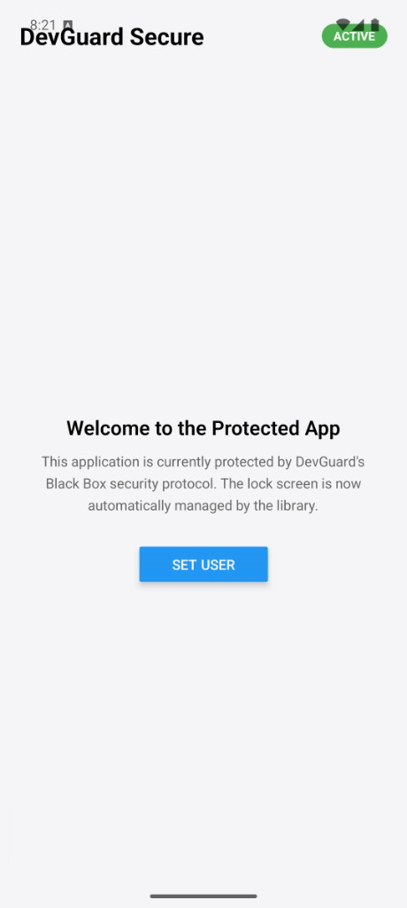
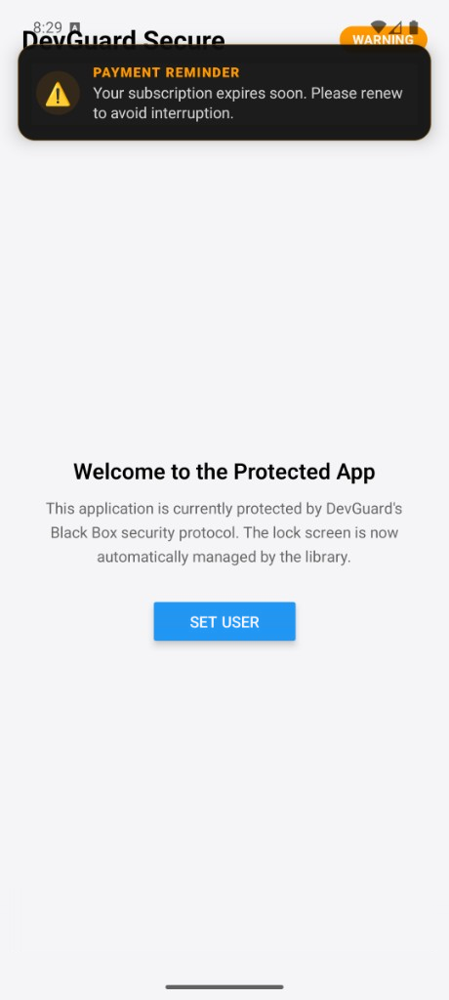
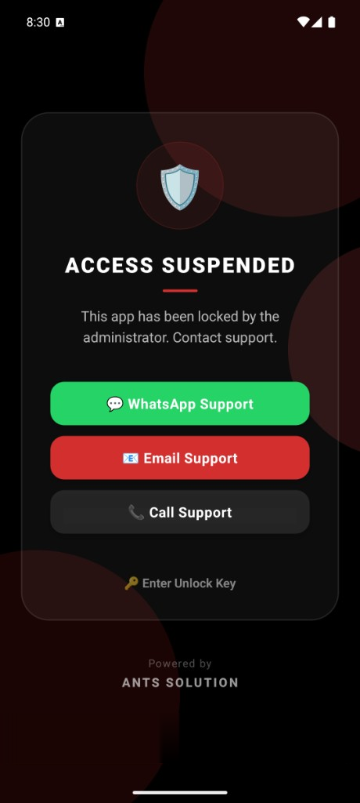

# React Native DevGuard

<p align="center">
  <a href="https://devguard.uk"></a>
  
  
</p>

**Protect your apps. Get paid.** DevGuard is a remote licensing and application-protection layer for React Native. Remotely **lock, warn, wipe, and monitor** your published apps from the DevGuard dashboard — ideal for agencies and developers who need to enforce payment terms or revoke access to client deliverables. Security-critical operations (HMAC signing, the shared secret, GZip telemetry) run inside a compiled **Native C++ module** so your keys never sit in plain JavaScript.

> 👉 **Create your free account and grab your keys at [devguard.uk](https://devguard.uk).**
> You'll need a **Project ID** and a **Master Secret** to initialize the SDK.

## 📱 How it looks

The Lock Screen, warning toast, and diagnostics overlay are all **built in** — you don't build any UI. DevGuard renders the right screen automatically based on the status returned by your dashboard.

<table>
  <tr>
    <td align="center" width="33%"></td>
    <td align="center" width="33%"></td>
    <td align="center" width="33%"></td>
  </tr>
  <tr>
    <td align="center"><b>Active &amp; Protected</b><br/>Your app runs normally · <code>ACTIVE</code></td>
    <td align="center"><b>In-App Warning</b><br/>Non-blocking toast (e.g. payment reminder) · <code>WARNING</code></td>
    <td align="center"><b>Access Suspended</b><br/>Automatic Lock Screen with your support contacts · <code>LOCKED</code></td>
  </tr>
</table>

## ✨ Features

- **Glassmorphic Lock Screen**: Premium, built-in UI that blocks access instantly — with your WhatsApp / Email / Call support buttons and an optional unlock-key entry.
- **Native Security**: HMAC signing and the shared secret are handled in compiled C++ to prevent secret extraction.
- **GZip Tunneling**: Compact telemetry payloads for minimum data usage.
- **Remote Config**: Access server-defined JSON settings via the `response` object.
- **Heartbeat & Sync**: Automated background pings (with `lifecycleSync` / `syncPolicy` support) to keep license status fresh.
- **Hardware Fingerprinting**: Robust device identity that survives app re-installs.
- **Emulator Blocking**: When the project enables `blockEmulators`, the SDK locks on emulators/simulators automatically.
- **Hardened Remote Wipe**: Nonce-based remote wipe clears the response cache, usage logs, encrypted vault diagnostics, and stored device-user identity.
- **Privacy-Gated Telemetry**: Advanced metrics (RAM, storage, battery, network) are only collected after the server enables `advancedTelemetry`.

## 🚀 Getting Started

### 1. Create your DevGuard account

1. Sign up at **[devguard.uk](https://devguard.uk)**.
2. Create a **Project** in the dashboard.
3. Copy your **Project ID** and **Master Secret** (Settings → Master Secret). You'll pass both to the SDK below.

### 2. Install

```bash
npm install react-native-dev-guard react-native-device-info react-native-keychain @react-native-async-storage/async-storage
# or
yarn add react-native-dev-guard react-native-device-info react-native-keychain @react-native-async-storage/async-storage
```

`@react-native-async-storage/async-storage` is required by the bundled Vault Logger (encrypted local diagnostics). Use **v3.x** with React Native 0.85+; run `npx pod-install` after adding it on iOS.

### 3. Native setup

#### Requirements
- **React Native** `0.85.x` (tested on `0.85.3`)
- **React** `19.2.x`
- **iOS** 15.1+ · **Android** minSdk 24

#### iOS
1. Open `ios/Podfile` and ensure your target meets React Native's minimum iOS version (`min_ios_version_supported`, currently 15.1).
2. Run `npx pod-install`.

#### Android
Ensure your app `minSdkVersion` is at least **24** (matches the RN 0.85 template).

### 4. Protect your app

Wrap your application root with `DevGuardProvider`. That's it — once the status returned by your dashboard is `LOCKED`, the Lock Screen appears automatically.

```tsx
import React from 'react';
import { DevGuardProvider } from 'react-native-dev-guard';

const App = () => {
  return (
    <DevGuardProvider
      projectId="your_project_id"   // From the DevGuard dashboard
      secret="YOUR_MASTER_SECRET"   // Settings → Master Secret
      autoProtect={true}            // Auto-show the Lock Screen when LOCKED
      failSafe="open"               // 'open' or 'closed' (offline behavior, no cache)
    >
      <MainApp />
    </DevGuardProvider>
  );
};

export default App;
```

## 🧭 Status lifecycle

DevGuard syncs on app launch, on foreground/background, and on a server-defined heartbeat. The current `status` drives what the user sees:

| Status | Meaning | What the user sees |
| --- | --- | --- |
| `ACTIVE` | Valid license / access granted. | Your app, running normally. |
| `WARNING` | App still works, but a notice is shown. | A non-blocking toast (e.g. *"Payment reminder"*). |
| `LOCKED` | Access revoked by you. | The built-in **Lock Screen** (when `autoProtect`). |
| `EXPIRED` | License expired. | Treated as locked. |
| `PENDING` | Initial state before the first successful sync (`failSafe: open`). | Your app (optimistic). |
| `ERROR` | Sync failed. | Depends on `failSafe` (see below). |

## 🪝 API

### `<DevGuardProvider>` props

| Prop | Type | Default | Description |
| --- | --- | --- | --- |
| `projectId` | `string` | **required** | Your DevGuard project ID. |
| `secret` | `string` | — | Your account **Master Secret** (Settings → Master Secret), used to authenticate requests. |
| `autoProtect` | `boolean` | `true` | Automatically render the built-in Lock Screen when status is `LOCKED` / `EXPIRED`. |
| `failSafe` | `'open' \| 'closed'` | `'open'` | Behavior when the server is unreachable and no cache exists. `open` keeps the app usable; `closed` locks it. |
| `apiKey` | `string` | — | **Deprecated** alias for `secret`. |

### `useDevGuard()`

```tsx
import { useDevGuard } from 'react-native-dev-guard';

const MyComponent = () => {
  const { status, response, isLocked, verify } = useDevGuard();

  return (
    <View>
      <Text>Status: {status}</Text>
      {response?.betaFeatures?.showBetaFeature && <BetaComponent />}
    </View>
  );
};
```

| Field | Type | Description |
| --- | --- | --- |
| `status` | `GuardStatus` | `ACTIVE` · `WARNING` · `LOCKED` · `EXPIRED` · `PENDING` · `ERROR`. |
| `isLocked` | `boolean` | `true` when status is `LOCKED` or `EXPIRED`. |
| `response` | `GuardResponse \| null` | Full server response (messages, contacts, `config`, `betaFeatures`, etc.). |
| `verify` | `(force?: boolean) => Promise<void>` | Manually trigger a license sync. |
| `unlock` | `(key: string) => Promise<boolean>` | Submit an unlock key; resolves `true` on success. |
| `setDeviceUser` | `(username?, email?, phone?, customData?) => Promise<void>` | Register the signed-in app user so they appear in the Developer Portal. |

### Track app users in the Developer Portal

When someone signs in or registers in your app, pass their profile to DevGuard. You'll then be able to see **how many users are using your application** in the **Developer Portal** — total user count, recent activity, and basic profile fields (username, email, phone, and any custom metadata you attach).

Call this after login or registration (all parameters are optional):

```tsx
const { setDeviceUser } = useDevGuard();

await setDeviceUser(
  'jane_doe',           // username
  'jane@example.com',   // email
  '+15551234567',       // phone
  { plan: 'pro' }       // any custom data
);
```

Open **Developer Portal → Users** to view your app's user base and engagement.

### Manual verification

Force a sync after a meaningful event (e.g. login or payment):

```tsx
const { verify } = useDevGuard();
await verify(true); // true forces a sync regardless of policy
```

### Unlock with a key

The built-in Lock Screen already includes an **"Enter Unlock Key"** flow, so most apps never call this directly — but it's available if you want a custom UI:

```tsx
const { unlock } = useDevGuard();
const ok = await unlock('USER-ENTERED-KEY');
```

## 🐞 Diagnostic Overlay & Vault Logger

DevGuard includes an integrated diagnostic UI (the Bug Icon) and an encrypted local Vault Logger for advanced debugging without rebuilding your app.

### Vault Logger
The SDK bundles `react-native-vault-logger`. By default, it automatically intercepts and encrypts fatal JS errors and usage info, saving them securely to local storage using **per-device AES-256-CBC keys** derived from the hardware `deviceId` at init (no static secret in source).
You can manually log data to the Info Vault:
```tsx
import { DevGuardLogger } from 'react-native-dev-guard/src/services/DevGuardLogger';

DevGuardLogger.info('User completed onboarding', { userId: 123 });
```

### The Bug Icon (Diagnostic Overlay)
To view telemetry and logs directly inside the running app without connecting a debugger:
1. Go to your DevGuard Admin Control Center.
2. Ensure you have configured a **6-digit Diagnostic Passcode**.
3. Under the project settings, toggle on **Enable Diagnostic Logs (Beta Feature)** for the desired devices.
4. A floating **🐛 Bug Icon** will appear in your app.
5. Tap it and enter your Passcode to view device telemetry and access the encrypted error vaults.

## ⚙️ Configuration

### Fail-Safe Modes
- **`open` (Default)**: If the server is unreachable and no cache exists, the app remains accessible.
- **`closed`**: The app will lock until a successful status is fetched.

## 🔐 Security Best Practices

1. **Obfuscation**: Always use `javascript-obfuscator` or similar tools for your JS bundle.
2. **Hermes**: Ensure Hermes is enabled in your `app/build.gradle` and `Podfile` to benefit from bytecode pre-compilation.
3. **ProGuard**: Use the included ProGuard rules to protect the native C++ library.

## 💬 Support & Contact

- 🌐 **Website / register:** [devguard.uk](https://devguard.uk)
- 📧 **Email:** [contact@devguard.uk](mailto:contact@devguard.uk)
- 🐛 **Issues:** [GitHub Issues](https://github.com/DevGuard-uk/react-native-dev-guard/issues)

## 📄 License

MIT © [DevGuard](https://devguard.uk)

---
*Secure by Design. Managed by You.*
